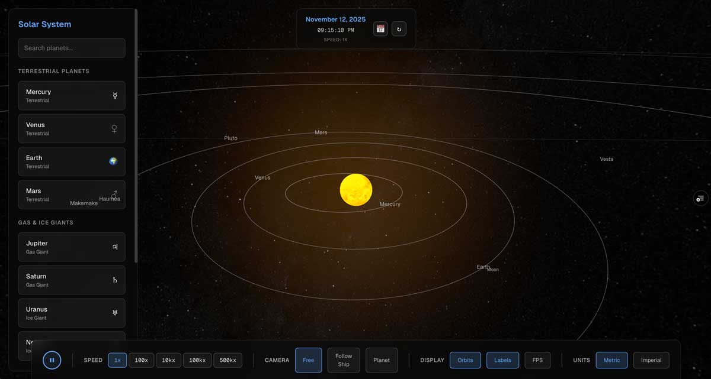
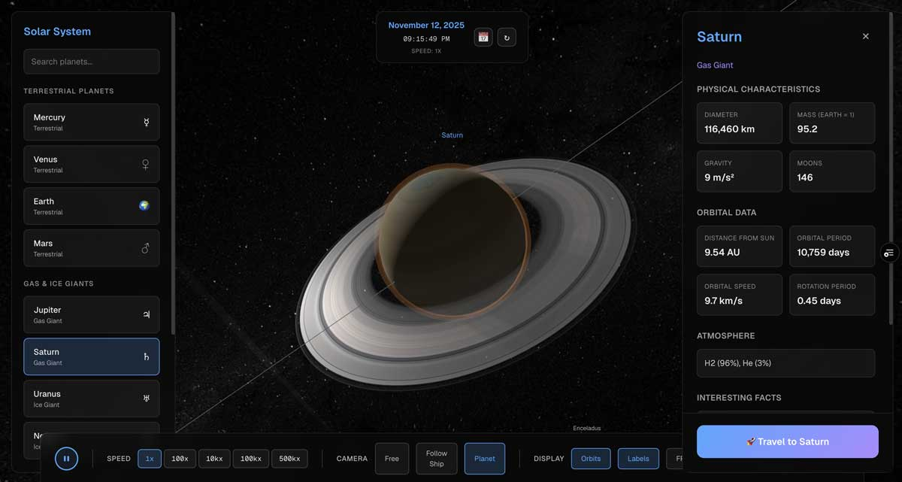
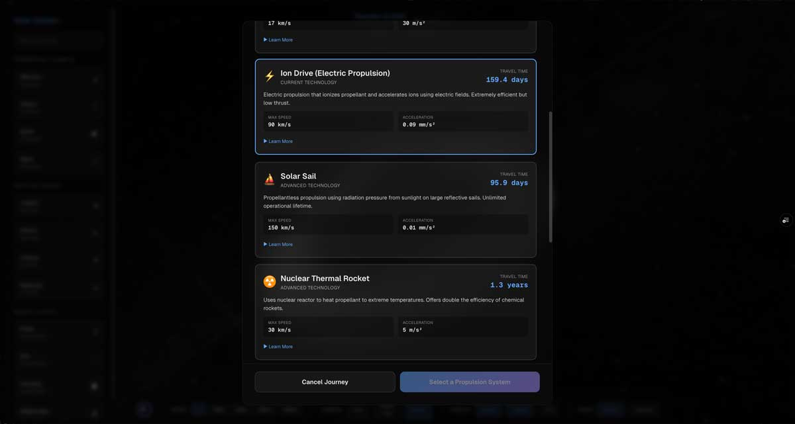
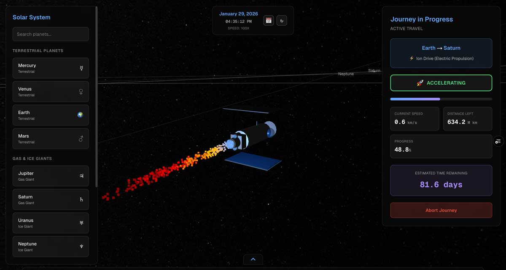

# 🚀 Solar System Propulsion Simulation

An interactive 3D space exploration experience that lets you journey through our solar system using different propulsion methods. Navigate between planets, experience realistic orbital mechanics, and compare various spacecraft propulsion technologies in a visually stunning simulation built with modern web technologies.

**[Launch the Simulation →](https://solar.chriswest.tech)**

---

## ✨ Experience the Journey

### Welcome to Space

*Begin your journey through the solar system with an immersive entry experience*

### Explore Planetary Details

*Get up close with Saturn and other planets in breathtaking detail*

### Choose Your Propulsion Method

*Select from different propulsion technologies, each with unique characteristics and performance*

### Engage the Thrusters

*Pilot your spacecraft through the cosmos and experience the vastness of space*

---

## 🎯 Features

- **Interactive 3D Solar System** - Explore planets with realistic textures and orbital mechanics
- **Multiple Propulsion Methods** - Compare different spacecraft propulsion technologies
- **Immersive Graphics** - Built with Three.js for stunning visual effects and post-processing
- **Smooth Performance** - Optimized texture loading and rendering for seamless navigation
- **Responsive Design** - Experience the simulation on any device

---

## 🛠️ Technologies Used

This project leverages cutting-edge web technologies to deliver a high-performance 3D experience:

- **[Next.js 16](https://nextjs.org)** - React framework with App Router for optimal performance
- **[React 19](https://react.dev)** - Latest React with React Compiler for automatic optimization
- **[Three.js](https://threejs.org)** - WebGL-powered 3D graphics library
- **[React Three Fiber](https://docs.pmnd.rs/react-three-fiber)** - React renderer for Three.js
- **[React Three Drei](https://github.com/pmndrs/drei)** - Useful helpers for React Three Fiber
- **[React Three Postprocessing](https://github.com/pmndrs/react-postprocessing)** - Post-processing effects for enhanced visuals
- **[Zustand](https://zustand-demo.pmnd.rs)** - Lightweight state management
- **[TypeScript](https://www.typescriptlang.org)** - Type-safe development
- **[Tailwind CSS](https://tailwindcss.com)** - Utility-first CSS framework
- **[Sass](https://sass-lang.com)** - Advanced CSS preprocessing

---

## 🚀 Building the Application

### Prerequisites

- Node.js 20.x or higher
- npm, yarn, pnpm, or bun

### Installation

Clone the repository and install dependencies:

```bash
git clone <repository-url>
cd solar
npm install
```

### Development

Run the development server:

```bash
npm run dev
```

Open [http://localhost:3000](http://localhost:3000) to see the application in development mode. The page will auto-reload as you make changes.

### Production Build

Build the application for production:

```bash
npm run build
```

Start the production server:

```bash
npm start
```

### Linting

Run the linter to check code quality:

```bash
npm run lint
```

---

## 📝 License

This project is a demonstration of modern web 3D capabilities and space exploration simulation.

---

**Built with ❤️ and modern web technologies**
